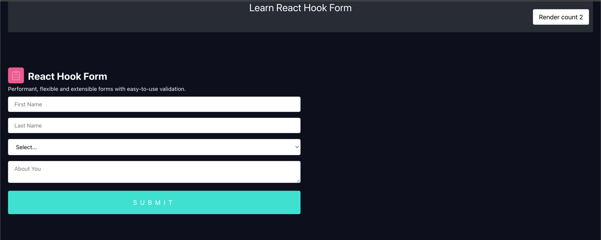

# Simple playground for react-hook-form-example

## Installed libraries:

### `npm install react-hook-form`

## Start App Scripts

In the project directory, you can run:

### `npm install`
### `npm start`

Runs the app in the development mode.
Open [http://localhost:3000](http://localhost:3000) to view it in the browser.

The page will reload if you make edits.
You will also see any lint errors in the console.

## Preview the app

